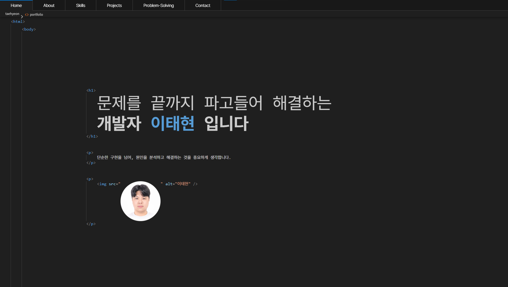

# 웹 포트폴리오

HTML 코드 · 터미널 컨셉의 React 기반 개발자 포트폴리오

## 🌐 배포

👉 **[https://taehyeon-portfolio.vercel.app/](https://taehyeon-portfolio.vercel.app/)**

## 📌 프로젝트 소개

HTML 태그 구조와 터미널 인터페이스를 컨셉으로 제작한 React 기반 웹 포트폴리오입니다.  
개발자의 작업 환경을 시각적으로 표현하고, 다양한 인터랙션을 통해 프로젝트와 개발 경험을 소개합니다.

### 주요 기능
- 🖥 HTML 코드 구조 형태의 UI 레이아웃
- 💻 터미널 기반 Contact 기능 (`help`, `info`, `phone`, `email`, `github` 명령어 지원)
- 📁 프로젝트 목록 및 상세 정보 인터랙션
- ⌨️ 단축키 지원 (`Ctrl+J` 터미널 토글 / `Ctrl+B` 프로젝트 상세 토글)

## 🛠 기술 스택

<table>
  <thead>
    <tr>
      <th>사용기술</th>
      <th>설명</th>
      <th>Badge</th>
    </tr>
  </thead>
  <tbody>
    <tr>
      <td>React.js</td>
      <td>컴포넌트 기반 UI 구성</td>
      <td></td>
    </tr>
    <tr>
      <td>SCSS</td>
      <td>컴포넌트별 스타일 관리</td>
      <td></td>
    </tr>
    <tr>
      <td>Figma</td>
      <td>UI/UX 디자인</td>
      <td></td>
    </tr>
    <tr>
      <td>GitHub / Git</td>
      <td>버전 관리</td>
      <td></td>
    </tr>
  </tbody>
</table>

## 📆 기간 및 인원
- 2026.03.27 ~ 2026.04.07
- 개인 프로젝트

## 📂 프로젝트 구조

```
📂src/
┣━━ 📂comp/
┃   ┣━━ 📄Header.jsx          # 상단 헤더
┃   ┣━━ 📄BodyTagLine.jsx     # HTML 태그 컨셉 레이아웃 (전체 섹션 포함)
┃   ┣━━ 📄Hero.jsx            # 자기소개 섹션
┃   ┣━━ 📄About.jsx           # About 섹션
┃   ┣━━ 📄Skills.jsx          # 기술 스택 섹션
┃   ┣━━ 📄Projects.jsx        # 프로젝트 목록 섹션
┃   ┣━━ 📄ProjectsDetails.jsx # 프로젝트 상세 정보 패널
┃   ┣━━ 📄ProblemSolving.jsx  # 문제 해결 경험 섹션
┃   ┣━━ 📄Terminal.jsx        # 터미널 인터페이스 (Contact)
┃   └━━ 📄Contact.jsx         # Contact 섹션
┣━━ 📂css/                    # 각 컴포넌트별 SCSS 파일
┣━━ 📄projects.json           # 프로젝트 데이터
┣━━ 📄App.jsx                 # 루트 컴포넌트 (터미널·상세 패널 상태 관리)
└━━ 📄index.js
```

## ⌨️ 단축키

| 단축키 | 기능 |
|--------|------|
| `Ctrl + J` | 터미널 창 토글 |
| `Ctrl + B` | 프로젝트 상세 패널 토글 |

## 💻 터미널 명령어

| 명령어 | 설명 |
|--------|------|
| `help` | 사용 가능한 명령어 목록 출력 |
| `info` | 기본 연락처 정보 출력 |
| `phone` | 전화번호 출력 |
| `email` | 이메일 출력 |
| `github` | GitHub 링크 출력 |

## 🚀 시작하기

```bash
npm install
npm start
```
